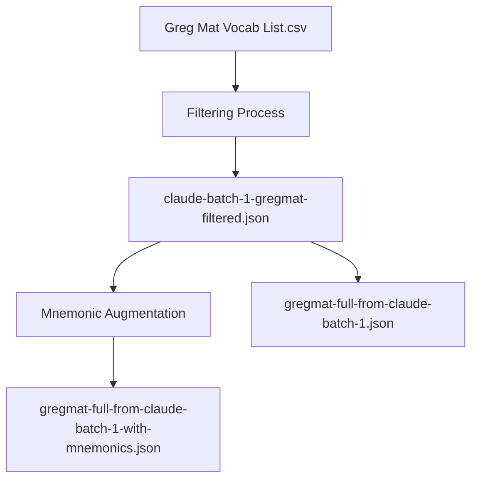

# Architectural Decisions

This document outlines the high-level architecture of the vocabulary project.

## Current Data Flow

The project currently consists of several JSON and CSV files representing vocabulary data at different stages of processing.

## Storage Strategy

Data is stored in flat JSON files to ensure maximum compatibility and ease of manual inspection.
