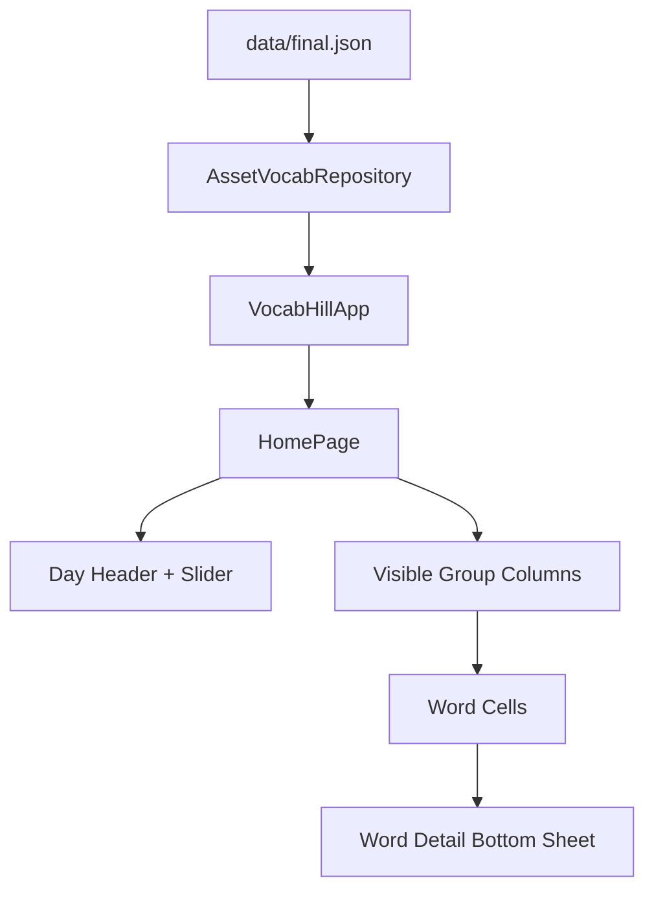

# Architecture

This folder contains the current runtime structure and the records for major design choices.

## Contents

- [Architectural Decisions](decisions/README.md)

## Current Topology

The current scaffold is deliberately simple:

- assets are the source of vocabulary content
- the repository isolates file loading from UI rendering
- the page state owns day selection and learned/forgotten session state
