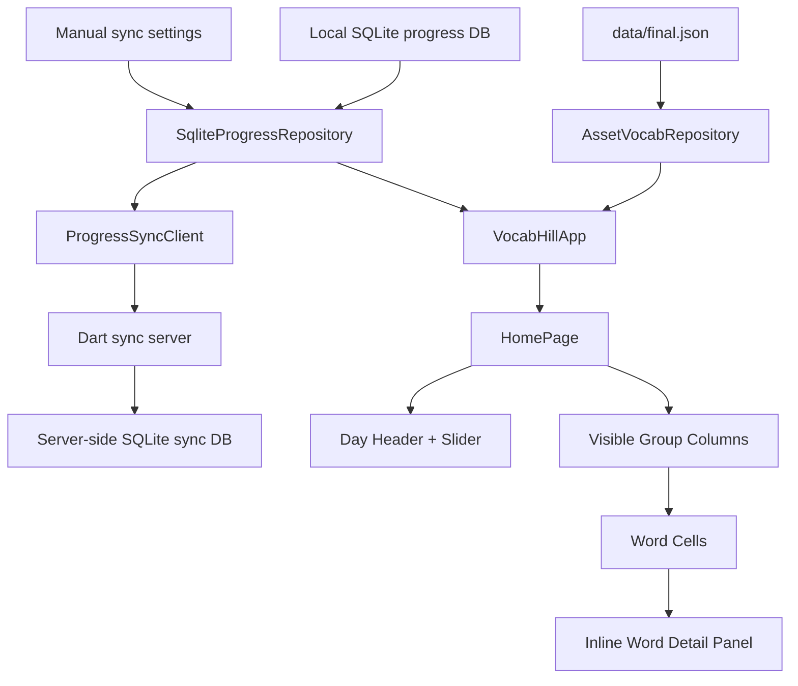

# Architecture

This folder contains the current runtime structure and the records for major design choices.

## Contents

- [Architectural Decisions](decisions/README.md)

## Current Topology

The current scaffold is deliberately simple:

- assets are the source of vocabulary content
- repositories isolate vocab loading, local persistence, and optional remote sync from UI rendering
- the page state restores persisted day selection and day-specific word marks from local SQLite before rendering the board
- cross-browser sync is optional and currently uses a manual sync key plus a small Dart backend
