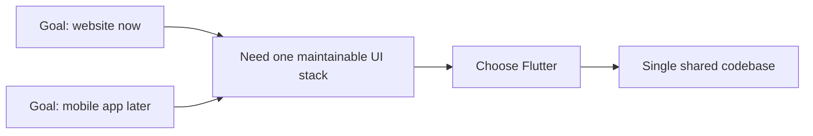

# ADR-001: Use Flutter As The First App Framework

## Status

Accepted

## Context

The project goal is to build a GregMat-style vocabulary trainer with a website first and a mobile app later. The initial repository already contains the vocabulary source data, but no application runtime. The first scaffold therefore needed to choose a frontend framework that would not force an early rewrite when mobile support becomes important.

## Decision

Use Flutter as the first application framework and generate the project at the repository root.

The first implementation loads words from `data/final.json`, renders the active group, and keeps session progress in widget state. The repository boundary is kept explicit so SQLite-backed persistence can replace asset loading later without rewriting the whole page tree.

## Consequences

- Positive: one codebase can target the website and later mobile clients.
- Positive: the app can start immediately from the existing local data files.
- Positive: the repository abstraction gives a clean path from assets to SQLite.
- Negative: local Flutter web support still needs to be configured on this machine before browser-based iteration is available.
