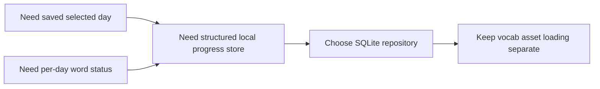

# ADR-002: Use SQLite For Local Learner Progress

## Status

Accepted

## Context

The app needs to persist the selected day and a learner's learned/forgotten status for each word on each day. The earlier key-value approach was enough for a prototype, but it did not provide a durable database boundary and was no longer aligned with the project's stated direction toward SQLite-backed local data.

## Decision

Store learner progress in a SQLite database managed by `SqliteProgressRepository`.

The repository stores:

- selected day in an `app_state` table
- per-day word status in a `word_progress` table keyed by `(day, word)`

The repository also performs a one-time migration from the older `SharedPreferences` keys so existing local progress is preserved.

## Consequences

- Positive: selected day and day-specific progress now live in a real database.
- Positive: the schema gives a cleaner path to future reporting, migration, and sync work.
- Positive: older local progress is migrated instead of silently discarded.
- Negative: web support now depends on the SQLite wasm worker assets generated into the `web/` folder.
