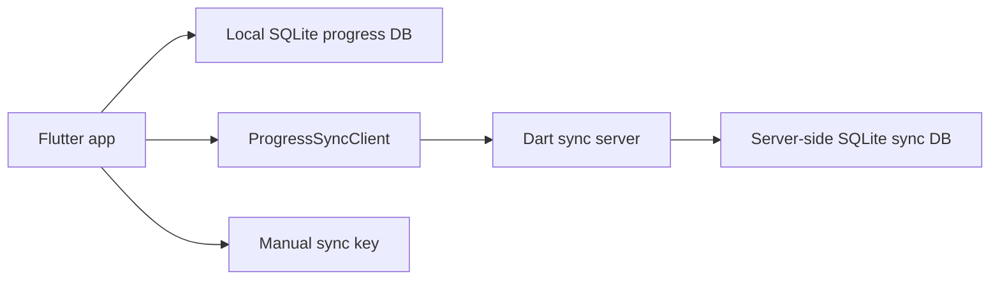

# ADR-003: Use A Manual Sync Key With A Small Dart Sync Backend

## Status

Accepted

## Context

The app now stores learner progress locally in SQLite, which works for one browser profile but does not carry progress across browsers or devices. The project goal leaves room for login later, but the immediate need is simpler: use the same learner progress in multiple browsers without introducing a full auth system yet.

## Decision

Use a small Dart HTTP server with a server-side SQLite database and a manual sync key as the temporary learner identity.

The Flutter app remains offline-first:

- local SQLite stays the primary runtime store
- the learner can enter a `server URL` and `sync key`
- the app merges local SQLite state with the backend on startup and after local edits
- the backend stores `selected day` plus per-day word statuses using timestamp-based last-write-wins conflict resolution

## Consequences

Positive:

- cross-browser progress works without waiting for a full login system
- the Flutter UI stays mostly unchanged because sync sits behind `ProgressRepository`
- local-first behavior still works if the backend is temporarily unavailable

Negative:

- a manual sync key is not real authentication and is only appropriate for personal or low-risk use
- conflict resolution is intentionally simple and based on timestamps, so simultaneous edits resolve by recency rather than user intent
- production use will still need a stronger identity and security model later
