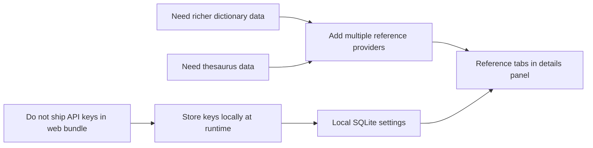

# ADR-004: Keep Merriam API Keys In Local SQLite And Support Multiple Reference Providers

## Status

Accepted

## Context

The app already had a free dictionary view backed by `dictionaryapi.dev`, but the learner now wants two additional reference views from Merriam-Webster: one dictionary endpoint and one thesaurus endpoint. Those endpoints require API keys.

The keys must not be embedded into the shipped website code. At the same time, this is still a personal-use tool with an offline-first local storage model, not a production backend with secret management.

## Decision

Support three reference providers inside the app:

- the existing free `dictionaryapi.dev` lookup
- Merriam-Webster Collegiate Dictionary
- Merriam-Webster Thesaurus

Store the Merriam-Webster API keys only in the local SQLite `app_state` settings boundary. The learner enters those keys through the existing settings dialog, and the app reads them at runtime when rendering the Merriam tabs.

The keys are not sent through the cross-browser sync API and are not compiled into the web bundle.

## Consequences

Positive:

- the details panel can show richer dictionary and thesaurus data without requiring a backend proxy
- API keys stay out of committed source and generated static web assets
- the app can enable or disable Merriam tabs independently per browser profile

Negative:

- browser-local SQLite is not true secret storage, so anyone with access to that browser profile can still inspect the keys
- the learner must re-enter Merriam keys on each browser profile because they are intentionally not synced
- the dictionary repository and details panel now have to handle multiple provider-specific response shapes and failure modes
