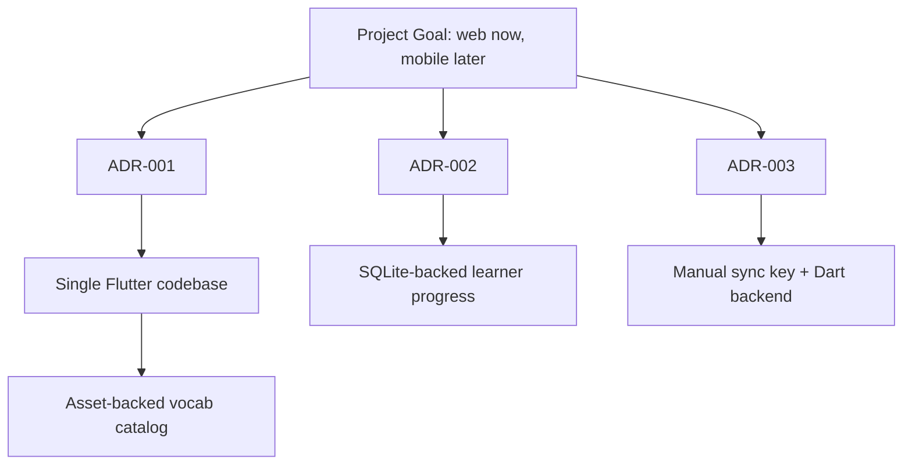

# Architectural Decisions

This index tracks the Architecture Decision Records for the project.

## ADRs

- [ADR-001: Use Flutter As The First App Framework](ADR-001-flutter-single-codebase.md)
- [ADR-002: Use SQLite For Local Learner Progress](ADR-002-sqlite-local-progress.md)
- [ADR-003: Use A Manual Sync Key With A Small Dart Sync Backend](ADR-003-sync-key-backend.md)

## Decision Map

