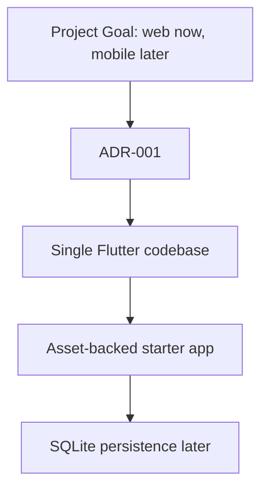

# Architectural Decisions

This index tracks the Architecture Decision Records for the project.

## ADRs

- [ADR-001: Use Flutter As The First App Framework](ADR-001-flutter-single-codebase.md)

## Decision Map

