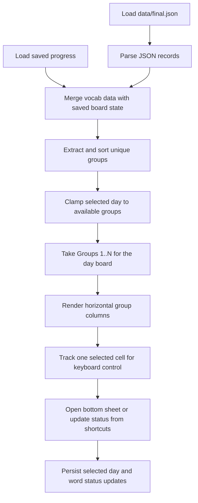

# Algorithms

This section records the small but important implementation decisions in the current scaffold.

## Current Flow

## Code References

`lib/src/repositories/vocab_repository.dart:L15-L22` — `AssetVocabRepository.loadWords` — loads the local JSON asset through Flutter's bundle API so the first scaffold can run without a database.

`lib/src/repositories/progress_repository.dart:L31-L68` — `SqliteProgressRepository.loadProgress` — restores selected day and per-day word states from SQLite so the same word can be classified independently on later study days.

`lib/src/repositories/progress_repository.dart:L100-L127` — `SqliteProgressRepository._openDatabase` — creates the local database and required tables before the UI uses progress data, because selected day and per-day word states now live in SQLite instead of key-value storage.

`lib/src/repositories/progress_repository.dart:L155-L231` — `SqliteProgressRepository._migrateLegacyPreferencesIfNeeded` — imports older `SharedPreferences` progress into SQLite once so existing local learner data survives the repository migration.

`lib/src/pages/home_page.dart:L51-L233` — `_HomePageState.build` — converts vocab data plus restored progress into a day board that reveals groups `1..N`, applies only the current day's marks, and attaches keyboard focus because the reference UI benefits from fast, spreadsheet-like movement.

`lib/src/pages/home_page.dart:L237-L246` — `_HomePageState._loadBoardData` — hydrates the screen from both repositories together so the board is rendered with consistent word content and saved learner state.

`lib/src/pages/home_page.dart:L248-L258` — `_HomePageState._sortedGroupNames` — preserves group identity while sorting numerically so `Group 10` does not appear before `Group 2`.

`lib/src/pages/home_page.dart:L260-L283` — `_HomePageState._clampSelection` — keeps the active keyboard cell inside the currently visible board so selection remains valid when the visible day range changes.

`lib/src/pages/home_page.dart:L285-L306` — `_HomePageState._setWordStatus` — writes status against the current day so moving to a later day does not overwrite the earlier day's classification of the same word.

`lib/src/pages/home_page.dart:L308-L316` — `_HomePageState._latestPreviousStatus` — walks backward through earlier days so each cell can show the most recent prior-day marker without mixing it into the current day's main status color.

`lib/src/pages/home_page.dart:L318-L384` — `_HomePageState._handleBoardKeyEvent` — maps arrows and `d` / `g` / `r` onto the selected cell so learners can move, toggle the details panel, and classify words without leaving the keyboard.

`lib/src/pages/home_page.dart:L124-L232` — `_HomePageState.build` — keeps the details panel inside the board screen instead of opening a modal route so keyboard navigation continues to work while details are visible.

`lib/src/pages/home_page.dart:L393-L450` — `_DayHeader.build` — ties the displayed day label and slider to the selected cumulative board because day navigation is now the primary control in the interface.

`lib/src/pages/home_page.dart:L455-L510` — `_GroupColumn.build` — renders each group as a fixed-width vertical strip and passes both current-day status and previous-day marker data into each cell.

`lib/src/pages/home_page.dart:L513-L570` — `_WordCell.build` — maps current-day status to cell background and the latest prior-day status to a small right-side circle so both today’s result and historical context are visible at once.
