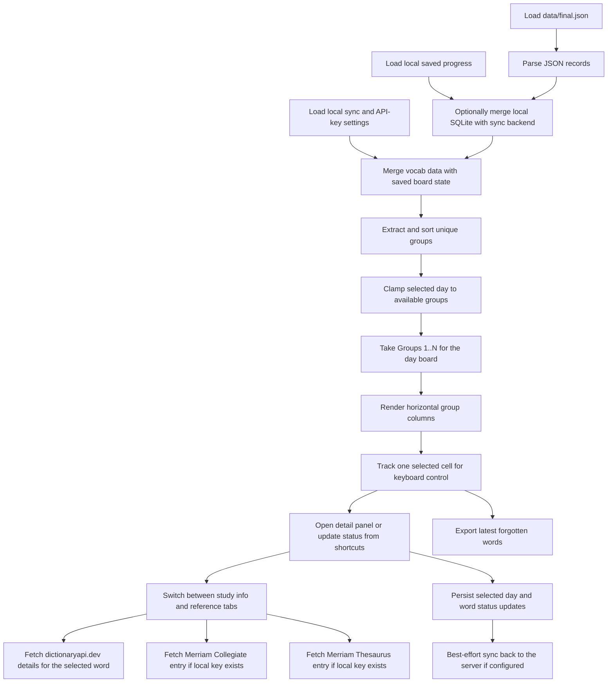

# Algorithms

This section records the small but important implementation decisions in the current scaffold.

## Current Flow

## Code References

`lib/src/repositories/vocab_repository.dart:L15-L22` — `AssetVocabRepository.loadWords` — loads the local JSON asset through Flutter's bundle API so the first scaffold can run without a database.

`lib/src/repositories/dictionary_repository.dart:L54-L147` — `ApiDictionaryRepository._fetchWord` — calls `dictionaryapi.dev` and memoizes parsed meanings, examples, synonyms, and antonyms so the details card can switch into a richer external dictionary view without repeatedly refetching the same word.

`lib/src/repositories/dictionary_repository.dart:L183-L259` — `ApiDictionaryRepository._fetchMerriamDictionary` — calls the Merriam-Webster Collegiate endpoint with the learner-supplied API key and reduces the response to short definitions, part of speech, pronunciation, and spelling suggestions for the dedicated dictionary tab.

`lib/src/repositories/dictionary_repository.dart:L261-L334` — `ApiDictionaryRepository._fetchMerriamThesaurus` — calls the Merriam-Webster Thesaurus endpoint with the learner-supplied API key and flattens nested synonym and antonym groups into a compact thesaurus view for the details panel.

`lib/src/repositories/progress_repository.dart:L29-L50` — `SqliteProgressRepository.loadProgress` — restores selected day and per-day word states from SQLite and performs optional startup sync so the same learner can resume in another browser.

`lib/src/repositories/progress_repository.dart:L89-L105` — `SqliteProgressRepository.saveSyncSettings` — stores the server URL and manual sync key in local SQLite so the learner can point multiple browsers at the same remote progress identity.

`lib/src/repositories/progress_repository.dart:L107-L131` — `SqliteProgressRepository.loadReferenceApiSettings` — restores the local Merriam-Webster dictionary and thesaurus keys from SQLite so reference tabs can be enabled per browser profile without shipping those credentials in code.

`lib/src/repositories/progress_repository.dart:L133-L146` — `SqliteProgressRepository.saveReferenceApiSettings` — updates the local Merriam-Webster dictionary and thesaurus keys in SQLite so the learner can change providers at runtime without rebuilding the app.

`lib/src/repositories/progress_repository.dart:L155-L194` — `SqliteProgressRepository._openDatabase` — creates the local database before the UI uses progress data, because selected day, sync settings, API keys, and timestamped per-day word states all live behind the same SQLite boundary now.

`lib/src/repositories/progress_repository.dart:L221-L288` — `SqliteProgressRepository._migrateLegacyPreferencesIfNeeded` — imports older `SharedPreferences` progress into SQLite once so existing local learner data survives the repository migration.

`lib/src/repositories/progress_repository.dart:L397-L420` — `SqliteProgressRepository._synchronizeIfConfigured` — serializes best-effort remote merge calls so startup sync and write-triggered sync do not race each other.

`lib/src/repositories/progress_repository.dart:L426-L458` — `SqliteProgressRepository._readSyncPayload` — converts local SQLite rows into a timestamped sync payload so the server can merge selected day changes, status updates, and clears across browsers.

`lib/src/repositories/progress_sync_client.dart:L75-L108` — `ProgressSyncClient.mergeSnapshot` — sends the entire local learner snapshot to the backend merge endpoint so the app can stay offline-first and still reconcile state remotely.

`bin/sync_server.py:L270-L274` — `main` — exposes the minimal HTTP surface needed for health checks, snapshot reads, and merge writes without pulling in a heavier backend stack when Python is the active runtime.

`bin/sync_server.py:L128-L196` — `merge_snapshot` — applies timestamp-based last-write-wins merges on the server so two browsers can reconcile selected day changes and per-word status updates through one SQLite database when Python is active.

`bin/sync_server.dart:L10-L42` — `main` — exposes the same health, snapshot, and merge endpoints as the Python backend so the active server runtime can be swapped without changing the Flutter client.

`bin/sync_server.dart:L140-L212` — `_mergeSnapshot` — mirrors the Python server's timestamp-based merge logic so either runtime updates the same SQLite file consistently.

`lib/src/pages/home_page.dart:L61-L269` — `_HomePageState.build` — converts vocab data plus restored progress and local API-key settings into a day board that reveals groups `1..N`, applies only the current day's marks, and attaches keyboard focus because the reference UI benefits from fast, spreadsheet-like movement.

`lib/src/pages/home_page.dart:L271-L284` — `_HomePageState._loadBoardData` — hydrates the screen from vocab, progress, sync settings, and local API keys together so the board and reference tabs render consistently on first paint.

`lib/src/pages/home_page.dart:L286-L332` — `_HomePageState._openSyncSettingsDialog` — saves both remote sync settings and local Merriam-Webster API keys from one dialog, then pulls merged remote state so another browser can resume the same learner progress immediately.

`lib/src/pages/home_page.dart:L334-L378` — `_HomePageState._openForgottenWordsDialog` — collects the words whose most recent saved state is `forgotten` and exposes them as a copyable comma-separated export from the top header.

`lib/src/pages/home_page.dart:L412-L435` — `_HomePageState._clampSelection` — keeps the active keyboard cell inside the currently visible board so selection remains valid when the visible day range changes.

`lib/src/pages/home_page.dart:L437-L440` — `_HomePageState._setSelectedDay` — writes the current day locally and triggers best-effort remote sync so day navigation stays resumable across browsers when sync is configured.

`lib/src/pages/home_page.dart:L460-L469` — `_HomePageState._latestPreviousStatus` — walks backward through earlier days so each cell can show the most recent prior-day marker without mixing it into the current day's main status color.

`lib/src/pages/home_page.dart:L471-L569` — `_HomePageState._handleBoardKeyEvent` — maps arrows plus `h` `j` `k` `l` and `d` / `t` / `y` / `u` / `g` / `r` onto the selected cell so learners can move, open any reference tab from the keyboard, and classify words without leaving the board.

`lib/src/pages/home_page.dart:L740-L822` — `_SyncSettingsDialogState.build` — combines remote sync identity fields with local Merriam-Webster key fields in one scrollable dialog so the learner can configure external services without exposing those keys in code.

`lib/src/pages/home_page.dart:L1041-L1137` — `_DetailsPanelState.build` — keeps the selected subview inside the details card and wraps the body in `SelectionArea` so reference text stays selectable while the learner switches between local study info, the free dictionary provider, and two Merriam-Webster tabs.

`lib/src/pages/home_page.dart:L1310-L1359` — `_DictionaryApiPanel.build` — loads the selected word through `DictionaryRepository` and renders loading, empty, and error states so the free external dictionary source does not block the rest of the details card.

`lib/src/pages/home_page.dart:L1371-L1445` — `_MerriamDictionaryPanel.build` — renders missing-key, loading, suggestion, and definition states so the Merriam dictionary tab stays usable even when the API returns alternatives instead of an exact headword.

`lib/src/pages/home_page.dart:L1457-L1541` — `_MerriamThesaurusPanel.build` — renders missing-key, loading, suggestion, and synonym/antonym states so the thesaurus tab can degrade cleanly when the learner has not configured a key or the headword has no exact hit.

`lib/src/pages/home_page.dart:L1651-L1665` — `_SourceLinkSection.build` — renders source URLs through a selectable external-link widget so dictionary and thesaurus references stay both copyable and clickable in web builds.

`lib/src/pages/home_page.dart:L1692-L1705` — `_SelectableExternalLinkState.build` — uses `SelectableText.rich` plus an explicit launcher gesture so source URLs remain both selectable and clickable in production web builds.

`lib/src/pages/home_page.dart:L635-L698` — `_DayHeader.build` — ties the displayed day label and slider to the selected cumulative board, exposes the settings dialog, and exports a copyable forgotten-word list from the page header.

`lib/src/pages/home_page.dart:L844-L880` — `_GroupColumn.build` — renders each group as a fixed-width vertical strip and passes both current-day status and previous-day marker data into each cell.

`lib/src/pages/home_page.dart:L897-L952` — `_WordCell.build` — maps current-day status to cell background and the latest prior-day status to a small right-side circle so both today’s result and historical context are visible at once.
