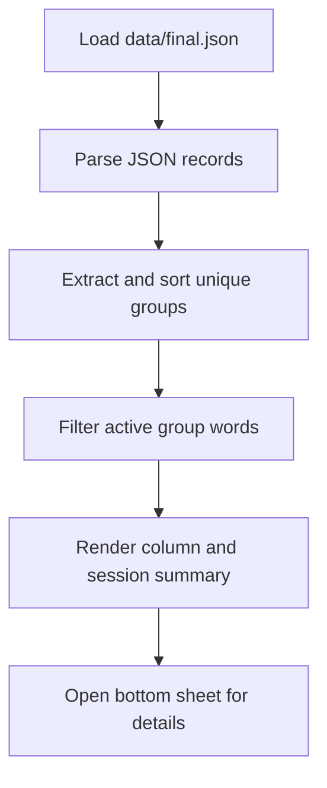

# Algorithms

This section records the small but important implementation decisions in the current scaffold.

## Current Flow

## Code References

`lib/src/repositories/vocab_repository.dart:L15-L22` — `AssetVocabRepository.loadWords` — loads the local JSON asset through Flutter's bundle API so the first scaffold can run without a database.

`lib/src/pages/home_page.dart:L30-L138` — `_HomePageState.build` — turns repository output into the active group view, navigation controls, and responsive layout because the page owns the first-pass study workflow.

`lib/src/pages/home_page.dart:L140-L157` — `_HomePageState._sortedGroupNames` — preserves group identity while sorting numerically so `Group 10` does not appear before `Group 2`.

`lib/src/pages/home_page.dart:L159-L173` — `_HomePageState._updateWordStatus` — enforces mutually exclusive learned and forgotten states so a word cannot be tracked as both in the same session.

`lib/src/pages/home_page.dart:L175-L207` — `_HomePageState._showWordDetails` — opens the detail sheet on demand so the word column stays dense while still exposing definition, Bangla, and mnemonic data.
