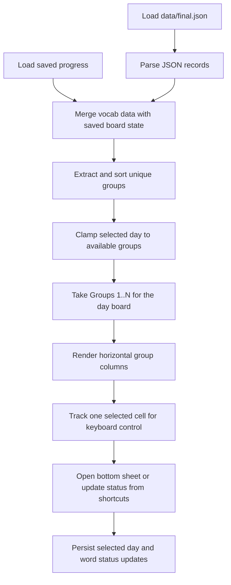

# Algorithms

This section records the small but important implementation decisions in the current scaffold.

## Current Flow

## Code References

`lib/src/repositories/vocab_repository.dart:L15-L22` — `AssetVocabRepository.loadWords` — loads the local JSON asset through Flutter's bundle API so the first scaffold can run without a database.

`lib/src/repositories/progress_repository.dart:L21-L42` — `SharedPreferencesProgressRepository.loadProgress` — restores the selected day and persisted word states so previous-day marks survive app restarts.

`lib/src/pages/home_page.dart:L49-L191` — `_HomePageState.build` — converts vocab data plus restored progress into a day board that reveals groups `1..N` and attaches keyboard focus because the reference UI benefits from fast, spreadsheet-like movement.

`lib/src/pages/home_page.dart:L193-L202` — `_HomePageState._loadBoardData` — hydrates the screen from both repositories together so the board is rendered with consistent word content and saved learner state.

`lib/src/pages/home_page.dart:L204-L214` — `_HomePageState._sortedGroupNames` — preserves group identity while sorting numerically so `Group 10` does not appear before `Group 2`.

`lib/src/pages/home_page.dart:L216-L239` — `_HomePageState._clampSelection` — keeps the active keyboard cell inside the currently visible board so selection remains valid when the visible day range changes.

`lib/src/pages/home_page.dart:L241-L255` — `_HomePageState._setSelectedDay` — updates local state and persists the selected day immediately so the same board reopens on the next visit.

`lib/src/pages/home_page.dart:L265-L331` — `_HomePageState._handleBoardKeyEvent` — maps arrows and `d` / `g` / `r` onto the selected cell so learners can move, toggle the details panel, and classify words without leaving the keyboard.

`lib/src/pages/home_page.dart:L145-L188` — `_HomePageState.build` — keeps the details panel inside the board screen instead of opening a modal route so keyboard navigation continues to work while details are visible.

`lib/src/pages/home_page.dart:L401-L458` — `_DayHeader.build` — ties the displayed day label and slider to the selected cumulative board because day navigation is now the primary control in the interface.

`lib/src/pages/home_page.dart:L461-L510` — `_GroupColumn.build` — renders each group as a fixed-width vertical strip so multiple groups can sit side by side like the reference layout.

`lib/src/pages/home_page.dart:L513-L559` — `_WordCell.build` — maps persisted study state and keyboard selection to the cell border so the board can communicate both progress and active cursor position without extra inline controls.
