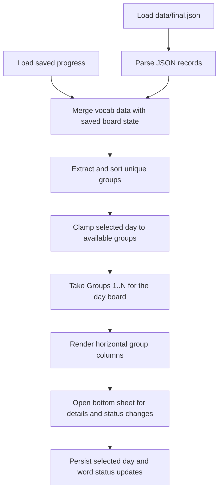

# Algorithms

This section records the small but important implementation decisions in the current scaffold.

## Current Flow

## Code References

`lib/src/repositories/vocab_repository.dart:L15-L22` — `AssetVocabRepository.loadWords` — loads the local JSON asset through Flutter's bundle API so the first scaffold can run without a database.

`lib/src/repositories/progress_repository.dart:L21-L42` — `SharedPreferencesProgressRepository.loadProgress` — restores the selected day and persisted word states so previous-day marks survive app restarts.

`lib/src/pages/home_page.dart:L39-L151` — `_HomePageState.build` — converts vocab data plus restored progress into a day board that reveals groups `1..N` because the reference UI is organized by cumulative daily progression rather than a single active group.

`lib/src/pages/home_page.dart:L153-L162` — `_HomePageState._loadBoardData` — hydrates the screen from both repositories together so the board is rendered with consistent word content and saved learner state.

`lib/src/pages/home_page.dart:L164-L174` — `_HomePageState._sortedGroupNames` — preserves group identity while sorting numerically so `Group 10` does not appear before `Group 2`.

`lib/src/pages/home_page.dart:L176-L190` — `_HomePageState._setSelectedDay` — updates local state and persists the selected day immediately so the same board reopens on the next visit.

`lib/src/pages/home_page.dart:L192-L240` — `_HomePageState._showWordDetails` — keeps the board cells visually clean by moving status changes and word metadata into an on-demand bottom sheet while persisting status changes when the learner selects them.

`lib/src/pages/home_page.dart:L250-L307` — `_DayHeader.build` — ties the displayed day label and slider to the selected cumulative board because day navigation is now the primary control in the interface.

`lib/src/pages/home_page.dart:L310-L356` — `_GroupColumn.build` — renders each group as a fixed-width vertical strip so multiple groups can sit side by side like the reference layout.

`lib/src/pages/home_page.dart:L358-L402` — `_WordCell.build` — maps persisted study state to cell background color so the board can communicate learned versus forgotten words without extra inline controls.
