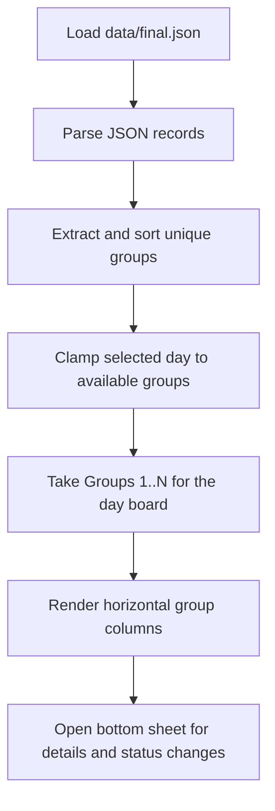

# Algorithms

This section records the small but important implementation decisions in the current scaffold.

## Current Flow

## Code References

`lib/src/repositories/vocab_repository.dart:L15-L22` — `AssetVocabRepository.loadWords` — loads the local JSON asset through Flutter's bundle API so the first scaffold can run without a database.

`lib/src/pages/home_page.dart:L29-L131` — `_HomePageState.build` — converts the repository output into a day board that reveals groups `1..N` because the reference UI is organized by cumulative daily progression rather than a single active group.

`lib/src/pages/home_page.dart:L133-L143` — `_HomePageState._sortedGroupNames` — preserves group identity while sorting numerically so `Group 10` does not appear before `Group 2`.

`lib/src/pages/home_page.dart:L145-L199` — `_HomePageState._showWordDetails` — keeps the board cells visually clean by moving status changes and word metadata into an on-demand bottom sheet.

`lib/src/pages/home_page.dart:L204-L258` — `_DayHeader.build` — ties the displayed day label and slider to the selected cumulative board because day navigation is now the primary control in the interface.

`lib/src/pages/home_page.dart:L264-L310` — `_GroupColumn.build` — renders each group as a fixed-width vertical strip so multiple groups can sit side by side like the reference layout.

`lib/src/pages/home_page.dart:L313-L357` — `_WordCell.build` — maps study state to cell background color so the board can communicate learned versus forgotten words without extra inline controls.
