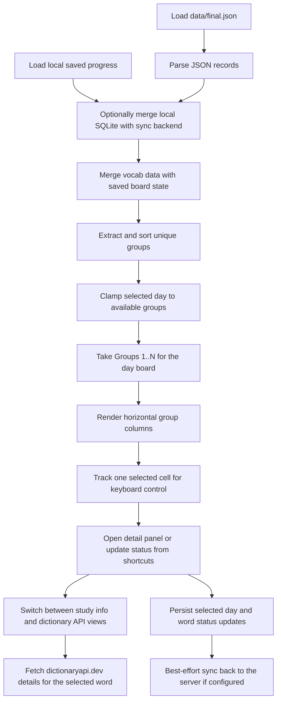

# Algorithms

This section records the small but important implementation decisions in the current scaffold.

## Current Flow

## Code References

`lib/src/repositories/vocab_repository.dart:L15-L22` — `AssetVocabRepository.loadWords` — loads the local JSON asset through Flutter's bundle API so the first scaffold can run without a database.

`lib/src/repositories/dictionary_repository.dart:L11-L156` — `ApiDictionaryRepository.lookupWord` — calls `dictionaryapi.dev` and memoizes parsed meanings, examples, synonyms, and antonyms so the details card can switch into a richer external dictionary view without repeatedly refetching the same word.

`lib/src/repositories/progress_repository.dart:L29-L50` — `SqliteProgressRepository.loadProgress` — restores selected day and per-day word states from SQLite and performs optional startup sync so the same learner can resume in another browser.

`lib/src/repositories/progress_repository.dart:L83-L105` — `SqliteProgressRepository.saveSyncSettings` — stores the server URL and manual sync key in local SQLite so the learner can point multiple browsers at the same remote progress identity.

`lib/src/repositories/progress_repository.dart:L107-L146` — `SqliteProgressRepository._openDatabase` — creates and upgrades the local database before the UI uses progress data, because selected day, sync settings, and timestamped per-day word states all live in SQLite now.

`lib/src/repositories/progress_repository.dart:L173-L250` — `SqliteProgressRepository._migrateLegacyPreferencesIfNeeded` — imports older `SharedPreferences` progress into SQLite once so existing local learner data survives the repository migration.

`lib/src/repositories/progress_repository.dart:L349-L371` — `SqliteProgressRepository._synchronizeIfConfigured` — serializes best-effort remote merge calls so startup sync and write-triggered sync do not race each other.

`lib/src/repositories/progress_repository.dart:L378-L409` — `SqliteProgressRepository._readSyncPayload` — converts local SQLite rows into a timestamped sync payload so the server can merge selected day changes, status updates, and clears across browsers.

`lib/src/repositories/progress_sync_client.dart:L75-L108` — `ProgressSyncClient.mergeSnapshot` — sends the entire local learner snapshot to the backend merge endpoint so the app can stay offline-first and still reconcile state remotely.

`bin/sync_server.py:L270-L274` — `main` — exposes the minimal HTTP surface needed for health checks, snapshot reads, and merge writes without pulling in a heavier backend stack when Python is the active runtime.

`bin/sync_server.py:L128-L196` — `merge_snapshot` — applies timestamp-based last-write-wins merges on the server so two browsers can reconcile selected day changes and per-word status updates through one SQLite database when Python is active.

`bin/sync_server.dart:L10-L42` — `main` — exposes the same health, snapshot, and merge endpoints as the Python backend so the active server runtime can be swapped without changing the Flutter client.

`bin/sync_server.dart:L140-L212` — `_mergeSnapshot` — mirrors the Python server's timestamp-based merge logic so either runtime updates the same SQLite file consistently.

`lib/src/pages/home_page.dart:L52-L245` — `_HomePageState.build` — converts vocab data plus restored progress into a day board that reveals groups `1..N`, applies only the current day's marks, and attaches keyboard focus because the reference UI benefits from fast, spreadsheet-like movement.

`lib/src/pages/home_page.dart:L247-L257` — `_HomePageState._loadBoardData` — hydrates the screen from vocab, progress, and sync settings together so the board and sync controls render consistently on first paint.

`lib/src/pages/home_page.dart:L260-L297` — `_HomePageState._openSyncSettingsDialog` — saves the server URL and sync key from the header dialog and then pulls merged remote state so another browser can resume the same learner progress immediately.

`lib/src/pages/home_page.dart:L311-L333` — `_HomePageState._clampSelection` — keeps the active keyboard cell inside the currently visible board so selection remains valid when the visible day range changes.

`lib/src/pages/home_page.dart:L336-L357` — `_HomePageState._setSelectedDay` — writes the current day locally and triggers best-effort remote sync so day navigation stays resumable across browsers when sync is configured.

`lib/src/pages/home_page.dart:L359-L367` — `_HomePageState._latestPreviousStatus` — walks backward through earlier days so each cell can show the most recent prior-day marker without mixing it into the current day's main status color.

`lib/src/pages/home_page.dart:L369-L435` — `_HomePageState._handleBoardKeyEvent` — maps arrows and `d` / `g` / `r` onto the selected cell so learners can move, toggle the details panel, and classify words without leaving the keyboard.

`lib/src/pages/home_page.dart:L815-L923` — `_DetailsPanelState.build` — keeps the selected subview inside the details card so the learner can switch between local study info and the richer dictionary API panel without leaving the current word.

`lib/src/pages/home_page.dart:L1008-L1066` — `_DictionaryApiPanel.build` — loads the selected word through `DictionaryRepository` and renders loading, empty, and error states so the external dictionary source does not block the rest of the details card.

`lib/src/pages/home_page.dart:L496-L554` — `_DayHeader.build` — ties the displayed day label and slider to the selected cumulative board and exposes sync settings because day navigation and sync setup now both live in the page header.

`lib/src/pages/home_page.dart:L657-L692` — `_GroupColumn.build` — renders each group as a fixed-width vertical strip and passes both current-day status and previous-day marker data into each cell.

`lib/src/pages/home_page.dart:L710-L765` — `_WordCell.build` — maps current-day status to cell background and the latest prior-day status to a small right-side circle so both today’s result and historical context are visible at once.
